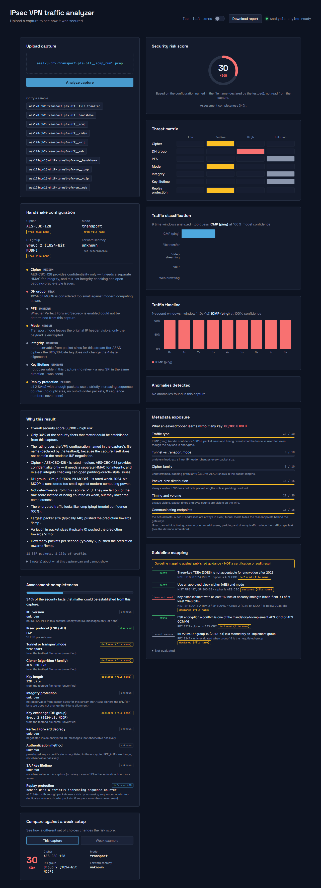

# IPsec VPN Traffic Analyzer  (SIH 2026, PS 26160)

Upload a packet capture (`.pcap`) of an IPsec VPN and get, in seconds:

* a **security score and risk level** (LOW / MEDIUM / HIGH) from the cipher, Diffie-Hellman group, forward secrecy and mode,
* a **traffic-type classification** of the encrypted data (web, video, VoIP, file transfer, ICMP) — *without decrypting anything*,
* a **timeline** of the traffic in 1-second windows, **anomaly flags**, and a **SHAP explanation** of why the model decided what it did,
* a downloadable **executive summary** and **technical report** (PDF / HTML), and a plain-English mode for non-experts.



## What is honest about it (read this)

| Finding | What the project does about it |
|---|---|
| The real testbed captures **contain no cleartext IKE negotiation** (only encrypted keep-alives + ESP), so cipher/DH cannot be read from them. | The IKE parser reports `unknown` instead of guessing. The API tags every value **observed / declared / unknown**; for the testbed files the cipher/DH/mode come from the *file name* and are labelled **declared**. |
| In the first dataset the `pfs-on` and `pfs-off` configs were **identical**. | PFS is shown as `unknown`; the testbed template was fixed (see `traffic-engineer/readme.MD`) but needs a re-run. |
| The old "100 % accuracy" came from the **packet count**: capture length was set by `tcpdump -c N`, and packet count alone predicts the class (`ml-engineer/shortcut_check.json`: 100 %). | Features are now fixed 1-second windows of ESP packets only; evaluation is cross-validation **grouped by VPN config**. Result: **100 % window / 100 % capture accuracy on unseen VPN configs** — but the five scripted traffic types are very easy to tell apart, so this is *not* a claim about real-world traffic. Sanity checks (shuffled labels, ablation) are in `ml-engineer/metrics.json`. |
| Tunnel-mode captures contain **decrypted** copies of packets (tcpdump on the peer). | Only ESP packets are used, i.e. what a real eavesdropper sees. |

Full list of findings, assumptions and open items: **[FINAL_STATUS.md](FINAL_STATUS.md)**.

## Quick start (Windows, PowerShell)

```powershell
cd E:\SIH\SIH_2026\SIH_2026_full
python -m venv venv
.\venv\Scripts\Activate.ps1
pip install -r requirements.txt

# terminal 1 - API           (http://127.0.0.1:8000/docs)
cd backend-developer
uvicorn main:app --port 8000

# terminal 2 - website       (http://localhost:5173)
cd frontend-developer
npm install
npm run dev
```
Then upload a file from `data/samples/` or click a sample button. Or run both with Docker: `docker compose up --build` → http://localhost:8080.

## Repository map

| Folder | Content |
|---|---|
| `backend-developer/` | FastAPI app (`main.py`), IKE parser, scoring engine, API contract (`contract.py`, `api_contract.md`) |
| `ml-engineer/` | feature extraction, training, `predict.py`, `metrics.json`, `confusion_matrix.png`, models |
| `frontend-developer/` | React + Vite dashboard (`src/api.js` talks to the API) |
| `reports/` | Jinja2 templates + `report_builder.py` (HTML → PDF with xhtml2pdf) |
| `docker/strongswan/`, `traffic-engineer/` | the two-peer VPN testbed and the capture orchestration |
| `data/` | small real sample captures + manifest (the full 216-pcap dataset is not in git) |
| `tests/` | 92 automated tests (`pytest`), synthetic IKE fixtures in `tests/fixtures/` (**labelled synthetic**) |
| `tools/` | e2e browser check, diagram/sample-report/deck generators |
| `docs/` | technical documentation, architecture diagram, sample reports, video script, slides |
| `integration-docs-lead/` | integration guide, test report, decisions log, run book |

## API in one minute

`POST /analyze` (multipart `file`) → one JSON shape (`schema_version 1.0`): `score`, `risk_level`, `cipher`, `mode`, `dh_group`, `pfs`,
`sources`, `breakdown`, `traffic`, `model_confidence`, `explanation` (plain strings), `anomalies`, `timeline`, `warnings`, `errors`.
Details: [backend-developer/api_contract.md](backend-developer/api_contract.md). Also `GET /health`, `GET /samples`, `POST /analyze/sample/{name}`,
`POST /report/{executive|technical}.{pdf|html}`.

## Tests

```powershell
.\venv\Scripts\python.exe -m pytest tests -q          # 92 tests
cd frontend-developer; npm run lint; npm run build      # both pass
.\venv\Scripts\python.exe tools\e2e_check.py           # real browser: upload → results → PDF download (needs requirements-dev.txt)
```

## Documentation

* [docs/TECHNICAL_DOCUMENTATION.md](docs/TECHNICAL_DOCUMENTATION.md) — architecture, algorithms, data, evaluation, limits
* [DEPLOY.md](DEPLOY.md) — click-by-click deployment (Vercel/Netlify + Render/Railway)
* [docs/VIDEO_SCRIPT.md](docs/VIDEO_SCRIPT.md) — 3-minute demo script with timed shots
* [docs/IPsec_VPN_Analyzer_Deck.pptx](docs/IPsec_VPN_Analyzer_Deck.pptx) — slides
* [docs/sample_reports/](docs/sample_reports/) — sample assessment generated from a real capture
* [integration-docs-lead/](integration-docs-lead/) — integration documentation
