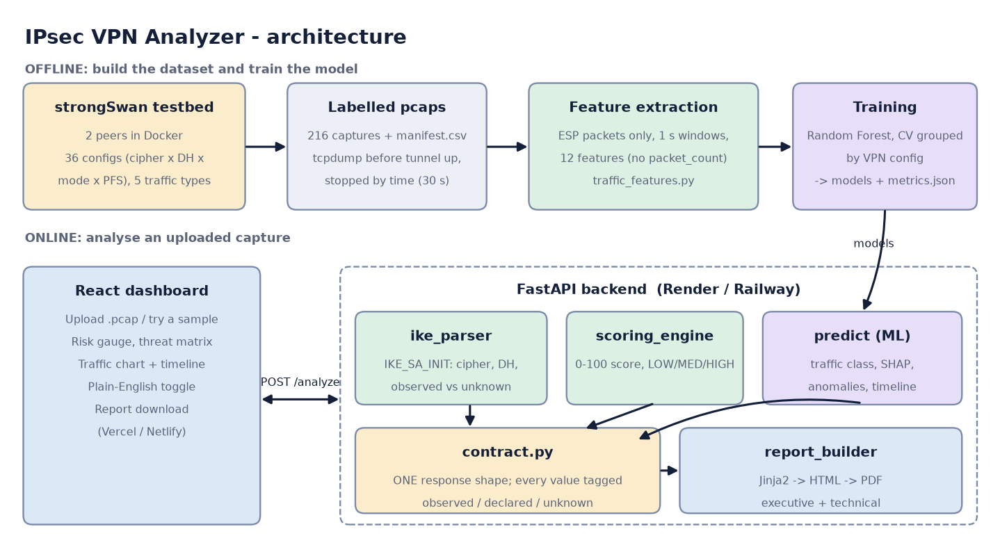
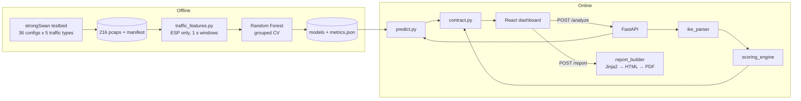

# Technical documentation — IPsec VPN Traffic Analyzer

## 1. Problem and approach

IPsec encrypts the payload, but an observer of the link still sees (a) the **IKE negotiation**, of which the first
exchange (`IKE_SA_INIT`) is in clear, and (b) the **size and timing** of the encrypted ESP packets. The analyzer uses both:

1. **Security posture** — read the negotiated cipher, key length and Diffie-Hellman group from `IKE_SA_INIT`, rate them, produce a 0–100 score.
2. **Traffic classification** — classify what runs *inside* the tunnel (web / video / VoIP / file transfer / ICMP) from packet size and timing patterns only.

## 2. Architecture

| Component | File(s) | Responsibility |
|---|---|---|
| IKE parser | `backend-developer/ike_parser.py` | Walk IKEv2 messages by hand (RFC 7296), validate headers, extract IKE SA proposal |
| Scoring | `backend-developer/scoring_engine.py` | Rate cipher / DH group / PFS, weighted score |
| Declared config | `backend-developer/config_hint.py` | Read the testbed's naming convention (fallback, clearly labelled) |
| Contract | `backend-developer/contract.py` | Merge observed + declared + ML into the single response; validator |
| Features | `ml-engineer/traffic_features.py` | pcap → ESP-only packets → fixed 1-second windows → 12 features |
| Model | `ml-engineer/train_model.py`, `predict.py` | Train/evaluate; predict, SHAP, anomalies, timeline |
| API | `backend-developer/main.py` | Endpoints, upload limits, CORS, temp-file handling |
| Reports | `reports/report_builder.py`, `templates/` | Jinja2 → HTML → PDF (xhtml2pdf, pure Python) |
| UI | `frontend-developer/src/` | Upload, gauge, matrix, charts, report download |

## 3. IKE parser

* Reads UDP/500 and UDP/4500 (with the 4-byte *non-ESP marker* removed), **validates** every candidate header — version byte `0x20`, exchange type 34–37,
  reserved flag bits, non-zero initiator SPI, length field consistent with the datagram — before trusting it. ESP-in-UDP and random UDP/4500 data are therefore not mistaken for IKE.
* Only `IKE_SA_INIT` (exchange 34) is parsed: the SA payload's proposals → cipher, key length, integrity, PRF, DH group. The **responder's selected** proposal is preferred over the initiator's offer; an offer-only capture is reported as such.
* Everything after it (`IKE_AUTH`, `CREATE_CHILD_SA`) is encrypted. Therefore **ESP cipher, PFS and tunnel/transport mode are not observable** and are returned as `unknown`/`None` — never defaulted (the original code defaulted mode to `"tunnel"`).
* `ike_version` is reported only when an `IKE_SA_INIT` was seen; encrypted IKE packets alone are counted and explained in `warnings`.
* Robustness: bounds-checked reads, streaming packet iteration (large files are not held in memory), truncated files/packets return partial results with `handshake.truncated = true`, non-pcap input raises `ValueError` (API: HTTP 400), file handles always closed (needed on Windows).

**Finding:** none of the 216 real captures contains an `IKE_SA_INIT`. The "handshake" files hold 2–4 encrypted `INFORMATIONAL` packets. The most likely cause (inferred from the script; not reproduced without Docker): the first orchestration script started `tcpdump` *inside* the container and then ran `docker restart`, which would kill it. The parser is therefore tested on **synthetic** IKE fixtures (`tests/fixtures/SYNTHETIC_*.pcap`, hand-assembled from the RFC and labelled as such everywhere).

## 4. Scoring

| Factor | Weight | strong (100) | medium (60) | weak (0) |
|---|---|---|---|---|
| Cipher | 0.4 | AES-GCM, ChaCha20-Poly1305, AES-CBC-256 | AES-CBC-128 | 3DES |
| DH group | 0.4 | 16, 19, 20, 21, 31 | 14, 15 | 1, 2, 5 |
| PFS | 0.2 | fresh DH for the child SA | – | none |

Score = Σ(points × weight) / Σ(weights of *rated* factors). **Unknown factors are excluded, never counted as weak.** Risk: ≥ 80 LOW, ≥ 50 MEDIUM, else HIGH; no rated factor → `UNKNOWN`.
Mode is displayed (tunnel = strong, transport = medium) but has weight 0.

### Observed vs declared
When the capture itself reveals nothing, `contract.py` falls back to the VPN configuration encoded in the **testbed file name** (`aes128gcm16-dh19-tunnel-pfs-on__web_run1.pcap`).
Each value carries `sources.*` = `observed` | `declared` | `unknown`, the response has `score_basis`, and the UI and both reports say so in words.
PFS is *not* taken from the file name (see §8).

## 5. Traffic classification (ML)

**Features** (`traffic_features.py`), per 1-second window of ESP packets: packets/s, bytes/s, mean/std/min/max/median packet size, mean/std/max inter-arrival time, share of packets and bytes in the first direction.
**Dropped on purpose:** `packet_count`, `total_bytes`, `duration` — they mostly encode *when tcpdump was told to stop*.
**ESP-only:** IP protocol 50 (or ESP-in-UDP/4500); IKE and the decrypted duplicates present in tunnel-mode files are excluded.
**Capture-level result:** the class with the highest mean probability across windows; confidence = that mean. Windows with < 2 packets are dropped.

**Evaluation protocol** (`train_model.py`): `StratifiedGroupKFold(6)` **grouped by VPN config** (36 groups) so every test fold consists of configurations never seen in training; out-of-fold predictions; metrics per window (1,027) and per capture (180).

| Result (real, `ml-engineer/metrics.json`) | Value |
|---|---|
| Random Forest, window level | accuracy 100 %, macro-F1 1.00 |
| Random Forest, capture level | accuracy 100 % |
| XGBoost (not selected) | 99.9 % window, 100 % capture |
| Majority-class baseline (window) | 59.5 % |
| Shuffled-label control (window) | 46.3 % (cannot beat the baseline ⇒ no pipeline leak) |
| Without rate features | 100 % (classes separable from size/timing shape alone) |
| Old shortcut: `packet_count` alone (`shortcut_check.json`) | **100 %** (why the old number meant nothing) |

**Read the 100 % carefully.** It says the approach separates *these five scripted traffic types* on unseen VPN configurations. The types have very different packet-size signatures (ICMP: fixed ~140 B; file transfer: full-MTU; VoIP: 27–30 packets of ~450 B ...). It is **not** evidence about real user traffic. Limits:
one capture per (config, class); synthetic generators; captures stopped by packet count so file transfer / VoIP / video are < 2 s long (1–2 windows); VoIP is SIP signalling only; classifying an *excerpt* of a transfer can go wrong (the first 300 packets of a file transfer are classified as video).
**Explainability:** SHAP `TreeExplainer`; signed contributions for the predicted class averaged over ≤ 80 evenly-sampled windows (the SHAP axes bug — a `(1, 12, 5)` array flattened and zipped with 12 names — is fixed and tested).
**Anomalies** (conservative rules, worded as "may indicate"): large data volume, high-throughput burst, large average packet size, one-way traffic, very long session, low classification confidence, no ESP found.

## 6. API and contract
See [`backend-developer/api_contract.md`](../backend-developer/api_contract.md). Key points: one response shape even on partial failure (`errors[]`), 50 MB default upload cap (20 MB on Render), streaming upload to a temp file that is always deleted, CORS via `ALLOWED_ORIGINS`, samples endpoint whitelisted (no path traversal), nothing is stored.

## 7. Frontend and reports
* React 19 + Vite + Recharts. `src/api.js` (base URL from `VITE_API_URL`) handles upload, samples, health and report download. Results are cleared while a new file is analysed. Offline, two **bundled real sample analyses** are shown (labelled).
* Reports: Jinja2 → HTML → PDF with **xhtml2pdf** because it is pure Python (no GTK / wkhtmltopdf / Chrome), so it installs with `pip` on Windows and on hosting. Charts are drawn with matplotlib and embedded as data URIs. *Executive*: 2 pages, risk box, plain-language settings table, rule-based recommendations, limits. *Technical*: score arithmetic, IKE parse facts, capture stats, class probabilities, SHAP, timeline, anomalies, model validation (numbers read from `metrics.json`).

## 8. Testbed
Two strongSwan peers in Docker; `traffic-engineer/scripts/orchestrate.py` runs 36 configs × 5 traffic types + a handshake capture.
Fixes made (not yet run against real containers — Docker was unavailable): PFS now adds a DH group to `esp=` (`esp=aes128-sha256-modp2048!`) — previously pfs-on and pfs-off configs were byte-identical; `keylife=25s` forces a child-SA rekey inside a 30 s capture; `tcpdump` starts before the tunnel is torn down and renegotiated (containers are no longer restarted); every capture is stopped by time (`timeout 30 tcpdump`); the manifest is upserted per file with `capture_stop` and `config_version` columns. Existing files are marked `v1-pfs-identical`.

## 9. Security considerations of the analyzer itself
Uploads are size-capped and streamed to a temp file that is deleted in a `finally`; only `.pcap/.pcapng`; the parser never executes anything from the file and bounds-checks every read; report HTML is auto-escaped (tested with `<script>` in a file name); no data is persisted; error messages do not leak stack traces. Not implemented: authentication and rate limiting (add before exposing publicly at scale).

## 10. Testing
95 pytest tests: IKE parser (synthetic fixtures, truncation, header validation), scoring, ML (SHAP shapes, windowing, ESP-only, no banned features), contract, API (real samples, declared-vs-observed, error cases, size limit), reports (real PDFs, text checked), testbed configs and orchestration order (fake Docker), docs. Plus `tools/e2e_check.py` (real Edge browser: upload → results → PDF download). Frontend: `npm run lint` and `npm run build` pass.

## 11. Future work
Re-run the fixed testbed (real IKE_SA_INIT, real PFS labels, 30 s captures, multiple runs); add real-world/non-scripted traffic; live capture; IKEv1 decoding; authentication and rate limiting; retrain and re-evaluate after re-capture.
